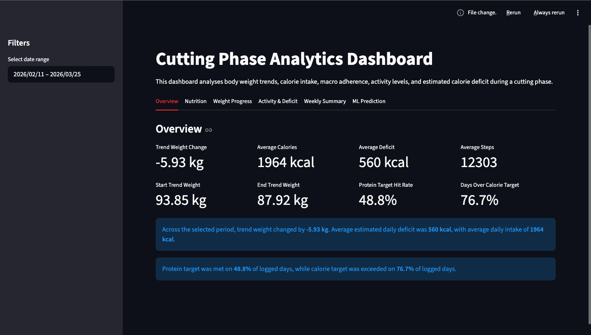
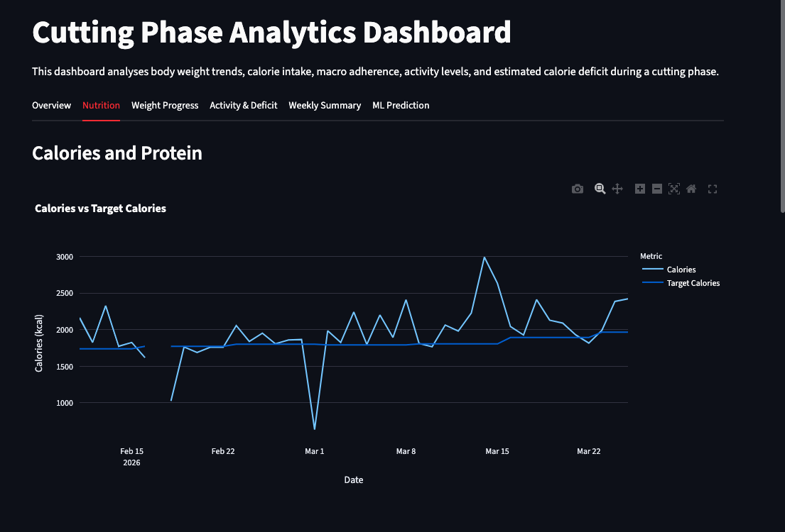
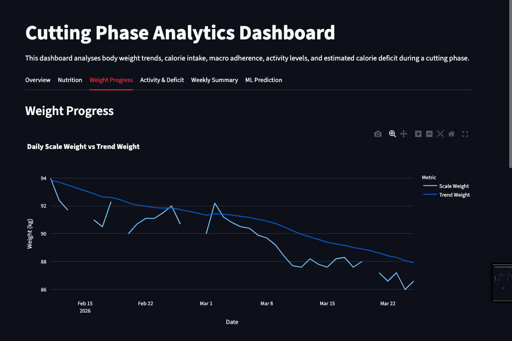
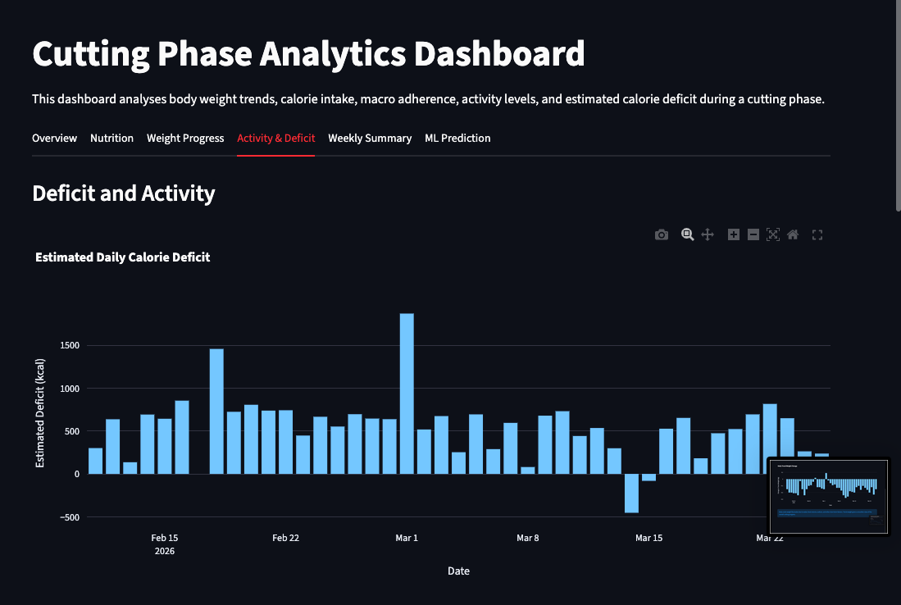

# Cutting Phase Analytics Dashboard

An end-to-end personal fitness analytics project using Python, SQLite, SQL, Streamlit, Plotly, and machine learning to analyse body weight trends, nutrition adherence, activity levels, and estimated calorie deficit during a cutting phase.

## Project Overview

This project began as an exploratory analysis of personal cutting-phase data and was expanded into a full analytics workflow.

The final version includes:

- a data cleaning and feature engineering pipeline
- a processed dataset
- a SQLite database
- SQL analysis queries
- an interactive Streamlit dashboard
- an exploratory machine learning model for next-day trend weight prediction

The project demonstrates practical skills in data cleaning, SQL analysis, dashboard development, data visualisation, and basic machine learning.

## Project Motivation

The goal of this project was to analyse whether calorie intake, expenditure, protein intake, and activity levels were consistent with successful weight loss during a cutting phase.

This project also serves as a portfolio project to demonstrate an end-to-end data workflow using a real personal dataset.

## Dataset

The dataset contains daily nutrition, activity, and body weight data exported from MacroFactor, covering an active cutting phase from mid-February 2026 to late March 2026.

Main variables include:

- `date`
- `weight_kg`
- `trend_weight_kg`
- `calories_kcal`
- `protein_g`
- `fat_g`
- `carbs_g`
- `target_calories_kcal`
- `target_protein_g`
- `target_fat_g`
- `target_carbs_g`
- `expenditure_kcal`
- `steps`
- `notes`

Additional engineered features include:

- `estimated_deficit_kcal`
- `calorie_difference`
- `protein_difference`
- `fat_difference`
- `carbs_difference`
- `protein_per_kg`
- `met_protein_target`
- `exceeded_calorie_target`
- `trend_weight_change`
- `scale_weight_change`
- `week`

## Tools Used

- Python
- pandas
- SQLite
- SQL
- Streamlit
- Plotly
- scikit-learn
- joblib
- Jupyter Notebook
- VS Code
- Git/GitHub

## Project Structure

```text
cutting-phase-analysis/
│
├── data/
│   ├── raw/
│   │   └── raw_cut_data.csv
│   ├── processed/
│   │   ├── processed_cut_data.csv
│   │   └── model_predictions.csv
│   └── fitness_cut.db
│
├── dashboard/
│   └── app.py
│
├── images/
│   ├── calorie_deficit.png
│   ├── weekly_averages.png
│   ├── weight_trend.png
│   └── dashboard/
│
├── models/
│   └── weight_prediction_model.pkl
│
├── notebooks/
│   └── 01_analysis.ipynb
│
├── sql/
│   └── 03_analysis_queries.sql
│
├── src/
│   ├── clean_data.py
│   ├── create_database.py
│   ├── query_database.py
│   └── train_model.py
│
├── README.md
├── requirements.txt
├── environment.yml
└── .gitignore
```

## Data Pipeline

```text
Raw MacroFactor CSV
        ↓
Data cleaning and feature engineering with Python
        ↓
Processed CSV
        ↓
SQLite database
        ↓
SQL analysis queries
        ↓
Streamlit dashboard
        ↓
Exploratory machine learning model
```

## Data Cleaning and Feature Engineering

The raw MacroFactor data is cleaned using `src/clean_data.py`.

The script:

- loads the raw CSV file
- converts the date column into datetime format
- sorts entries by date
- calculates estimated calorie deficit
- compares actual intake with calorie and macro targets
- creates target adherence columns
- calculates protein intake relative to body weight
- creates weekly grouping variables
- calculates daily weight change metrics
- saves the cleaned dataset to `data/processed/processed_cut_data.csv`

Key engineered features include:

```python
estimated_deficit_kcal = expenditure_kcal - calories_kcal
calorie_difference = calories_kcal - target_calories_kcal
protein_difference = protein_g - target_protein_g
protein_per_kg = protein_g / trend_weight_kg
```

## SQLite Database and SQL Analysis

The cleaned dataset is loaded into a local SQLite database using `src/create_database.py`.

The database file is stored at:

```text
data/fitness_cut.db
```

The main table is:

```text
daily_cut_data
```

SQL queries are stored in:

```text
sql/03_analysis_queries.sql
```

The SQL analysis includes:

- overall summary statistics
- start vs end trend weight comparison
- weekly averages
- calorie target adherence
- protein target adherence
- highest deficit days
- lowest deficit or surplus days
- highest protein days
- high step count days
- average deficit by step range
- days where calories were over target but deficit was still positive

Example query:

```sql
SELECT
    week,
    COUNT(*) AS logged_days,
    ROUND(AVG(weight_kg), 2) AS avg_scale_weight,
    ROUND(AVG(trend_weight_kg), 2) AS avg_trend_weight,
    ROUND(AVG(calories_kcal), 1) AS avg_calories,
    ROUND(AVG(protein_g), 1) AS avg_protein,
    ROUND(AVG(estimated_deficit_kcal), 1) AS avg_estimated_deficit,
    ROUND(AVG(steps), 0) AS avg_steps
FROM daily_cut_data
GROUP BY week
ORDER BY week;
```

## Streamlit Dashboard

The interactive dashboard is built with Streamlit and Plotly.

To run the dashboard:

```bash
streamlit run dashboard/app.py
```

The dashboard includes:

- date range filtering
- overview KPI cards
- weight trend visualisation
- daily scale weight vs trend weight
- calories vs target calories
- protein vs target protein
- protein intake per kg of trend body weight
- estimated daily calorie deficit
- daily step count
- steps vs estimated deficit scatterplot
- weekly summary table
- weekly average trend weight
- weekly average estimated deficit
- machine learning prediction comparison

## Dashboard Screenshots

### Overview



### Nutrition



### Weight Progress



### Activity and Deficit



### Machine Learning Prediction


## Machine Learning Extension

An exploratory machine learning model was built to predict next-day trend weight using nutrition, activity, expenditure, and current trend weight features.

The target variable is:

```text
next_day_trend_weight
```

Features used include:

- `trend_weight_kg`
- `calories_kcal`
- `protein_g`
- `fat_g`
- `carbs_g`
- `expenditure_kcal`
- `steps`
- `estimated_deficit_kcal`
- `protein_per_kg`

Models compared:

- Baseline model
- Linear Regression
- Random Forest Regressor

The baseline model predicts tomorrow’s trend weight as today’s trend weight. This was included because trend weight changes gradually, making it a strong simple benchmark.

The dashboard compares actual next-day trend weight against:

- the baseline prediction
- the best selected model prediction
- individual model predictions when the full model comparison option is selected

The machine learning model is exploratory and should not be interpreted as a production-level prediction system.

## Key Findings

- Trend weight decreased consistently across the cutting phase.
- Daily scale weight fluctuated, but trend weight gave a clearer view of progress.
- The average estimated calorie deficit was positive across the period.
- Weekly averages gave a clearer picture than daily values.
- Protein intake was close to target on many days, but the protein target was not met every day.
- Calorie target was exceeded on many days, but a positive estimated deficit was still often maintained due to expenditure and activity.
- Step count and expenditure helped explain some variation in estimated daily deficit.
- The baseline model was a useful benchmark because trend weight changes gradually from day to day.
- The machine learning model should be interpreted cautiously due to the small dataset size.

## Results Summary

From the original analysis period:

- Trend weight decreased by approximately **5.93 kg**
- Scale weight decreased by approximately **7.40 kg**
- Average daily estimated calorie deficit was approximately **560 kcal**
- Average daily calorie intake was approximately **1,964 kcal**
- Average daily protein intake was approximately **184 g**
- Average daily steps were approximately **12,303**
- Protein target was met on roughly **half** of logged days
- Calorie target was exceeded on most logged days

## Limitations

- The dataset covers a relatively short period.
- Some days had missing scale weight entries.
- Nutrition and activity data depend on tracking accuracy.
- MacroFactor trend weight is already a smoothed metric, which makes next-day prediction easier but less generalisable.
- The machine learning model is exploratory and not intended for production use.
- More data across multiple cutting, maintenance, or bulking phases would improve model reliability.
- The model does not account for factors such as sleep, sodium intake, water retention, stress, or training performance.

## How to Run the Project

### 1. Clone the repository

```bash
git clone https://github.com/marcokho3-cmyk/cutting-phase-analysis.git
cd cutting-phase-analysis
```

### 2. Create and activate a Conda environment

```bash
conda create -n cutting-dashboard python=3.10
conda activate cutting-dashboard
```

### 3. Install dependencies

Using Conda:

```bash
conda install pandas matplotlib scikit-learn joblib jupyter numpy
conda install -c conda-forge streamlit plotly statsmodels
```

Alternatively, using `requirements.txt`:

```bash
pip install -r requirements.txt
```

### 4. Regenerate the processed dataset

```bash
python src/clean_data.py
```

### 5. Create the SQLite database

```bash
python src/create_database.py
```

### 6. Run SQL query outputs

```bash
python src/query_database.py
```

### 7. Train the machine learning model

```bash
python src/train_model.py
```

### 8. Launch the Streamlit dashboard

```bash
streamlit run dashboard/app.py
```

## Reproducible Workflow

To fully regenerate the project outputs from the raw data, run:

```bash
python src/clean_data.py
python src/create_database.py
python src/query_database.py
python src/train_model.py
streamlit run dashboard/app.py
```

## Future Improvements

- Add more data from future cutting, maintenance, or bulking phases
- Deploy the Streamlit dashboard online
- Add rolling averages and moving trend comparisons
- Add more detailed weekly adherence analysis
- Compare predicted weight change against actual weekly outcomes
- Add more advanced time-series modelling
- Add automated data validation checks
- Add training performance data
- Add sleep and recovery metrics if available
- Improve dashboard styling and layout further

## Resume Summary

Built an end-to-end fitness analytics dashboard using Python, pandas, SQLite, SQL, Streamlit, Plotly, and scikit-learn to analyse calorie intake, macro adherence, activity levels, and body weight trends from personal nutrition tracking data; engineered deficit and adherence metrics, developed interactive visualisations, and created an exploratory regression model to predict short-term trend weight changes.