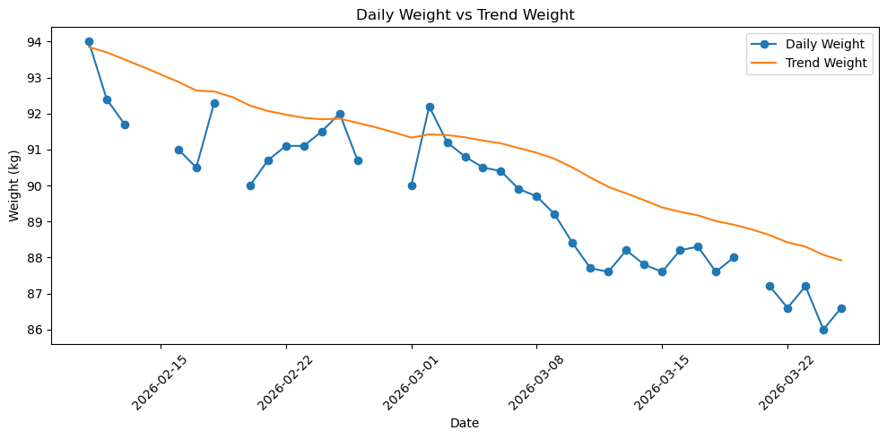
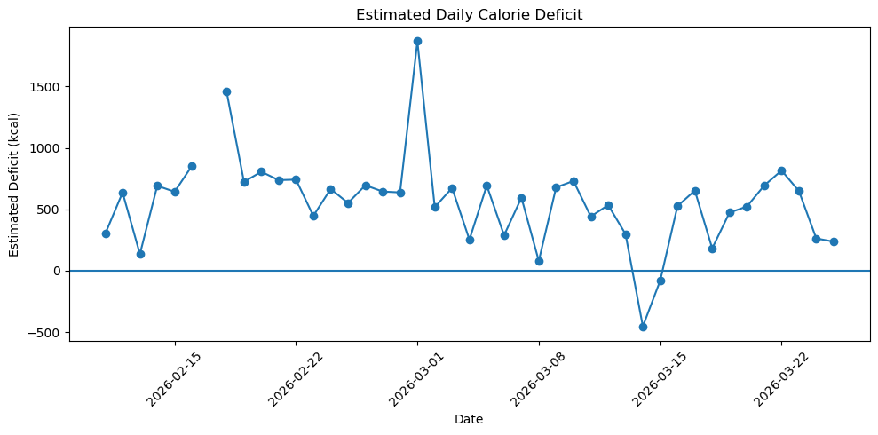
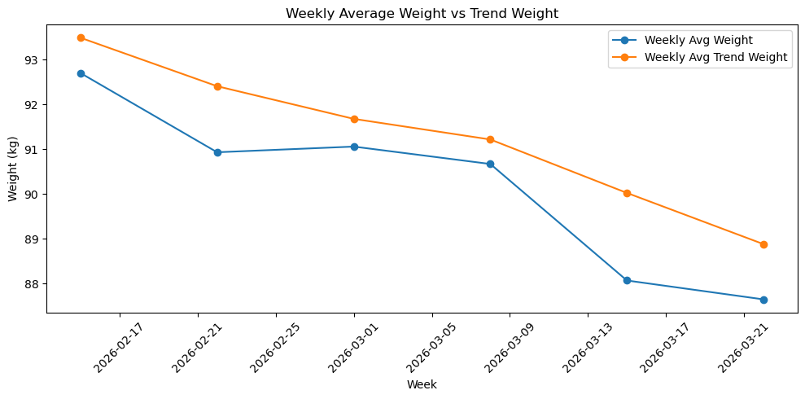

# Cutting Phase Analysis

A personal data analysis project using Python to explore body weight trends, calorie intake, macro adherence, activity levels, and estimated calorie deficit during an active cutting phase.

## Project Goal
The goal of this project is to analyze whether my calorie intake, expenditure, protein intake, and activity levels were consistent with a successful cutting phase.

## Dataset
This project uses daily nutrition, activity, and body weight data exported from MacroFactor, covering the active cutting phase from mid-February 2026 to late March 2026.

Main variables used:
- date
- weight_kg
- trend_weight_kg
- calories_kcal
- protein_g
- fat_g
- carbs_g
- target_calories_kcal
- target_protein_g
- target_fat_g
- target_carbs_g
- expenditure_kcal
- steps

## Scope
The analysis focuses on the active cutting phase only. Early February entries before consistent cutting and nutrition logging began were excluded from the final dataset.

## Tools Used
- Python
- pandas
- matplotlib
- Jupyter Notebook
- VS Code

## Analyses Performed
This project includes:
- daily weight vs trend weight analysis
- estimated daily calorie deficit analysis
- actual vs target calorie comparison
- actual vs target protein comparison
- daily step count analysis
- weekly average analysis for weight, calories, protein, deficit, and steps
- summary statistics for intake, expenditure, activity, and weight change
- adherence metrics for calorie and protein targets

## Key Findings
- Trend weight decreased across the cutting phase despite normal day-to-day fluctuations in scale weight.
- Estimated calorie deficit was positive on average, which aligned with the overall downward trend in body weight.
- Daily body weight was noisy, so trend weight was more useful than raw weigh-ins for judging progress.
- Protein intake was reasonably close to target, although the target was only met on half of logged days.
- Weekly averages provided a clearer picture of progress by reducing the noise present in daily values.

## Results
- Trend weight decreased by **5.93 kg** across the active cutting phase.
- Scale weight decreased by **7.40 kg** across the recorded period.
- Average daily estimated calorie deficit was **559.9 kcal**.
- Average daily calorie intake was **1963.9 kcal**, compared with an average target of **1815.1 kcal**.
- Average daily protein intake was **184.4 g**, compared with an average target of **193.0 g**.
- Protein target was met on **50.0%** of logged days.
- Calorie target was exceeded on **78.6%** of logged days.
- Average daily steps were **12,303**, supporting a relatively high activity level during the cut.

## Sample Visuals

### Daily Weight vs Trend Weight

### Estimated Daily Calorie Deficit

### Weekly Average Weight vs Trend Weight

## Limitations
- Some days had incomplete nutrition or activity logging.
- Incomplete edge weeks were excluded from parts of the weekly average analysis to avoid distorted comparisons.
- The notes column is mostly blank because contextual day-level notes were not consistently recorded during the cut.

## Future Improvements
- add graph screenshots to the README
- improve notebook presentation further
- build a dashboard or predictive extension as a future version of the project